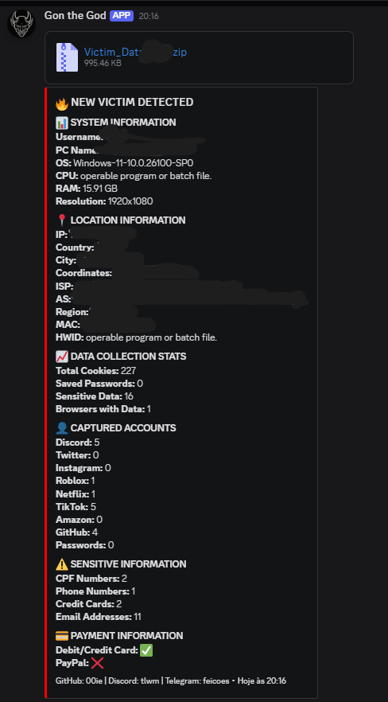

# GON Logger - Cybersecurity Project

[](https://www.python.org/downloads/) [](README.md)

> **⚠️ DISCLAIMER**  
> This project is developed exclusively for **educational and academic purposes** as part of a Cybersecurity degree program. It is designed to demonstrate security vulnerabilities, data collection techniques, and defensive strategies in controlled environments.

---

## Table of Contents

- [Project Overview](#-project-overview)
- [Educational Objectives](#-educational-objectives)
- [Architecture & Features](#-architecture--features)
- [Installation & Setup](#-installation--setup)
- [Usage Instructions](#-usage-instructions)
- [Technical Analysis](#-technical-analysis)
- [Defensive Measures](#-defensive-measures)
- [Legal & Ethical Considerations](#-legal--ethical-considerations)
- [Academic References](#-academic-references)
- [Contributors](#-contributors)

---

## Project Overview

**GON Logger** is an educational information gathering tool developed as  demonstrate:

- How malicious actors collect system information
- Browser data extraction techniques
- Network communication via webhooks
- Data obfuscation and persistence methods
- Detection and prevention strategies

### Example Output



*Figure: Educational demonstration showing data collection and reporting format via Discord webhook. This controlled test environment showcases the type of system and browser information that can be extracted, emphasizing the importance of proper security measures.*

**What the test demonstrates:**
- ✅ System information collection (OS, CPU, RAM, HWID)
- ✅ Network data gathering (IP, geolocation, ISP details)
- ✅ Browser data enumeration (cookies, passwords, autofill)
- ✅ Screenshot capture capability
- ✅ Sensitive information pattern detection (CPF, emails, phone numbers)
- ✅ Data aggregation and reporting via webhook
- ✅ Organized presentation of collected intelligence

This example illustrates the **real-world impact** of information gathering tools and why organizations must implement robust security controls, endpoint protection, and user awareness training.

### Academic Context

This project serves as a **practical laboratory exercise** for:
- Understanding OSINT (Open Source Intelligence) techniques
- Analyzing malware behavior patterns
- Developing detection signatures
- Implementing security countermeasures
- Ethical hacking and penetration testing education

---

## Educational Objectives

### Primary Learning Goals

1. **Threat Analysis**
   - Understanding data exfiltration mechanisms
   - Identifying attack vectors and vulnerabilities
   - Analyzing malware communication patterns

2. **Security Architecture**
   - Studying system information gathering APIs
   - Understanding browser security models
   - Learning about data encryption/decryption

3. **Defensive Security**
   - Developing detection signatures
   - Implementing monitoring solutions
   - Creating incident response procedures

4. **Ethical Considerations**
   - Understanding legal boundaries
   - Recognizing privacy implications
   - Applying responsible disclosure principles

---

## Architecture & Features

### System Components

```
┌─────────────────────────────────────────────┐
│           GON Logger Architecture           │
├─────────────────────────────────────────────┤
│                                             │
│  ┌──────────────┐      ┌─────────────────┐  │
│  │   Builder    │────▶│  Main Module    │  │
│  │  (builder.py)│      │   (main.py)     │  │
│  └──────────────┘      └─────────────────┘  │
│         │                      │            │
│         ▼                      ▼            │
│  ┌──────────────┐      ┌─────────────────┐  │
│  │ Obfuscation  │      │ Data Collection │  │
│  │   Engine     │      │    Modules      │  │
│  └──────────────┘      └─────────────────┘  │
│                               │             │
│                               ▼             │
│                        ┌─────────────────┐  │
│                        │  SQLite Storage │  │
│                        │  (victims.db)   │  │
│                        └─────────────────┘  │
│                               │             │
│                               ▼             │
│                        ┌─────────────────┐  │
│                        │ Discord Webhook │  │
│                        │  Communication  │  │
│                        └─────────────────┘  │
└─────────────────────────────────────────────┘
```

### Data Collection Capabilities

#### System Information
- Hardware ID (HWID)
- Operating System details
- CPU information
- RAM specifications
- Screen resolution
- MAC address
- Network configuration

#### Network Data
- IP address
- Geolocation (city, country, coordinates)
- ISP information
- Autonomous System (AS) data
- Timezone information

#### Browser Data (Educational Analysis)
- **Supported Browsers**: Chrome, Edge, Firefox, Brave, Opera, Vivaldi
- Cookie extraction mechanisms
- Saved password structures (encrypted)
- Autofill data schemas
- Session token patterns

#### Sensitive Information Detection
- Pattern recognition for:
  - CPF (Brazilian ID) numbers
  - Phone numbers
  - Email addresses
  - Credit card number formats

#### Additional Capabilities
- Screenshot capture
- Payment method enumeration (Discord)
- Social media token extraction (educational)

---

## Installation & Setup

### Prerequisites

```bash
# Required Software
- Python 3.8 or higher
- pip package manager
- Windows OS (for full functionality)
- Virtual Machine (RECOMMENDED for testing)
```

### Installation Steps

1. **Clone the Repository**
```bash
git clone https://github.com/00ie/gon-logger.git
cd gon-logger
```

2. **Create Virtual Environment** (Recommended)
```bash
python -m venv venv
venv\Scripts\activate  # Windows
# or
source venv/bin/activate  # Linux/Mac
```

3. **Install Dependencies**
```bash
pip install -r Requirements.txt
```

### Dependencies Overview

```
discord-webhook==1.1.0    # Webhook communication
browser-cookie3==0.19.1   # Browser data extraction
pycryptodome==3.20.0      # Cryptographic operations
pywin32==306              # Windows API access
requests==2.31.0          # HTTP requests
psutil==5.9.6             # System information
prettytable==3.9.0        # Data formatting
pyautogui==0.9.54         # Screenshot capability
pillow==10.1.0            # Image processing
```

---

## Usage Instructions

### ⚠️ CRITICAL: Testing Environment

**NEVER run this tool on:**
- Production systems
- Systems you don't own
- Networks without explicit authorization
- Public or shared computers

**ALWAYS use:**
- Isolated virtual machines (VMware, VirtualBox, Hyper-V)
- Sandboxed environments
- Dedicated test networks
- Your own authorized systems

### Configuration

#### 1. Set Up Discord Webhook (for educational monitoring)

```bash
python builder.py
```

Follow the interactive prompts:
```
Enter webhook URL: https://discord.com/api/webhooks/YOUR_WEBHOOK_ID/YOUR_TOKEN
Enter output filename: test_output
Add obfuscation? (y/n): y
Compile to .exe? (y/n): n  # Recommended for testing
```

#### 2. Understanding the Builder

The builder (`builder.py`) demonstrates:
- Configuration management
- Code obfuscation techniques (marshal/zlib)
- PyInstaller compilation process
- Icon embedding methods

#### 3. Analyzing the Output

After building, you'll have:
```
test_output.py          # Configured script
victims.db              # SQLite database (created on execution)
```

### Educational Testing

```bash
# Run in isolated VM only
python test_output.py
```

**What happens:**
1. System information is collected
2. Data is stored in `victims.db`
3. Formatted report is sent to Discord webhook
4. Screenshot is captured and included

### Database Analysis

```bash
# Examine collected data
sqlite3 victims.db

# View tables
.tables

# Query victims
SELECT * FROM victims;

# Query sensitive data
SELECT * FROM sensitive_data;
```

---

## Technical Analysis

### Security Mechanisms Demonstrated

#### 1. Browser Data Extraction

**Chrome/Chromium-based Browsers:**
```python
# Demonstrates encryption key retrieval
Local State file → os_crypt.encrypted_key
→ CryptUnprotectData (DPAPI)
→ AES-256-GCM decryption
```

**Firefox:**
```python
# Uses browser_cookie3 library
cookies.sqlite → direct SQLite access
```

#### 2. Data Obfuscation

```python
# Marshal + Zlib compression
original_code → compile() → marshal.dumps() 
→ zlib.compress() → base64 encoding
```

#### 3. Persistence Strategies

- SQLite database for local storage
- Webhook communication for remote exfiltration
- Multi-threaded execution for efficiency

#### 4. Evasion Techniques

- Hidden file attributes (`FILE_ATTRIBUTE_HIDDEN`)
- Temporary directory usage
- No console window (`--noconsole` flag)
- Dynamic import resolution

---

## Defensive Measures

### Detection Strategies

#### 1. Network Monitoring

```python
# Monitor outbound connections to Discord
Suspicious Pattern: POST requests to discord.com/api/webhooks/*
Alert on: Large data transfers to webhook endpoints
```

#### 2. File System Monitoring

```python
# Watch for suspicious file access
Monitor: 
- %LOCALAPPDATA%\Google\Chrome\User Data\Local State
- %APPDATA%\Discord\Local Storage\leveldb\*.ldb
- Temporary directory file operations
```

#### 3. Process Behavior Analysis

```python
# Suspicious API call patterns
Red Flags:
- CryptUnprotectData calls
- Multiple browser database access
- Screenshot capture (PIL.ImageGrab)
- Network activity to webhook services
```

#### 4. Endpoint Detection

**YARA Rule Example:**
```yara
rule GON_Logger_Detection {
    meta:
        description = "Detects GON Logger patterns"
        author = "Cybersecurity Student"
    strings:
        $webhook = "discord.com/api/webhooks/" ascii
        $browser_cookie = "browser_cookie3" ascii
        $crypto = "CryptUnprotectData" ascii
        $victims_db = "victims.db" ascii
    condition:
        3 of them
}
```

### Prevention Strategies

1. **Application Whitelisting**
   - Only allow approved executables
   - Block unsigned/unknown binaries

2. **Browser Security**
   - Use master passwords
   - Enable hardware security keys
   - Regular credential rotation

3. **Network Segmentation**
   - Block unnecessary outbound traffic
   - Monitor webhook/API endpoints
   - Implement DLP (Data Loss Prevention)

4. **User Education**
   - Phishing awareness training
   - Safe download practices
   - Social engineering recognition

---

## Legal & Ethical Considerations

### Legal Framework

#### [Computer Fraud and Abuse Act (CFAA) - USA](https://www.law.cornell.edu/uscode/text/18/1030)
- **18 U.S.C. § 1030**: Unauthorized access to computers
- Penalties: Fines and/or imprisonment up to 20 years

#### [General Data Protection Regulation (GDPR) - EU](https://gdpr.eu/)
- **Article 32**: Security of processing
- **Article 33**: Breach notification requirements

#### [Lei Geral de Proteção de Dados (LGPD) - Brazil](https://www.planalto.gov.br/ccivil_03/_ato2015-2018/2018/lei/l13709.htm)
- **Art. 46**: Security measures for personal data
- Penalties: Up to 2% of revenue (max R$ 50 million)

### Ethical Use Guidelines

#### Acceptable Use
- ✅ Personal system analysis (your own devices)
- ✅ Authorized penetration testing
- ✅ Academic research in controlled environments
- ✅ Security awareness training
- ✅ Malware analysis laboratories

#### Prohibited Use
- ❌ Unauthorized access to any system
- ❌ Data theft or exfiltration
- ❌ Privacy violations
- ❌ Commercial exploitation
- ❌ Malicious distribution

### Academic Integrity

As a Cybersecurity student, you must:
1. **Obtain explicit written authorization** before testing
2. **Use isolated environments** for all experiments
3. **Document findings responsibly**
4. **Follow responsible disclosure** for vulnerabilities
5. **Respect privacy and confidentiality**

---

## Academic References

### Recommended Reading

1. **Malware Analysis**
   - [*Practical Malware Analysis* - Michael Sikorski & Andrew Honig](https://books.google.com.br/books/about/Practical_Malware_Analysis.html?id=DhuTduZ-pc4C&redir_esc=y)
   - [*The Art of Memory Forensics* - Michael Hale Ligh et al.](https://www.wiley.com/en-us/The+Art+of+Memory+Forensics%3A+Detecting+Malware+and+Threats+in+Windows%2C+Linux%2C+and+Mac+Memory-p-9781118825099)

2. **Browser Security**
   - [*The Browser Hacker's Handbook* - Wade Alcorn et al.](https://www.wiley.com/en-us/The+Browser+Hacker's+Handbook-p-9781118662090)
   - [*Web Application Security* - Andrew Hoffman](https://www.amazon.com/Web-Application-Security-Exploitation-Countermeasures/dp/1492053112)

3. **Ethical Hacking**
   - [*The Web Application Hacker's Handbook* - Dafydd Stuttard](https://www.wiley.com/en-us/The+Web+Application+Hacker's+Handbook%3A+Finding+and+Exploiting+Security+Flaws%2C+2nd+Edition-p-9781118026472)
   - [*Penetration Testing* - Georgia Weidman](https://www.amazon.com/Penetration-Testing-Hands-Introduction-Hacking/dp/1593275641)

4. **Legal & Ethics**
   - [*Cybersecurity Law* - Jeff Kosseff](https://www.amazon.com/Cybersecurity-Law-Jeff-Kosseff/dp/1119517206)
   - [*Computer Security and Privacy* - NIST Special Publications](https://csrc.nist.gov/publications/sp800)

### Research Papers

- [“Why Aren’t HTTP-only Cookies More Widely Deployed?”](https://www.ieee-security.org/TC/W2SP/2010/papers/p25.pdf)
- [“Isolating First Party Cookies using CookieGuard"](https://arxiv.org/pdf/2405.06830)
- ["Machine-learning malware detection"](https://www.ndss-symposium.org/wp-content/uploads/ndss2021_4C-5_24475_paper.pdf)
- [“Machine Learning for Detecting Data Exfiltration”](https://www.researchgate.net/publication/351418605_Machine_Learning_for_Detecting_Data_Exfiltration_A_Review)

### Online Resources

- [OWASP Foundation](https://owasp.org)
- [NIST Cybersecurity Framework](https://www.nist.gov/cyberframework)
- [SANS Reading Room](https://www.sans.org/reading-room)
- [MITRE ATT&CK Framework](https://attack.mitre.org)

---

## Security Recommendations

### For Security Professionals

1. **Use this tool to:**
   - Understand attacker methodologies
   - Develop detection signatures
   - Train security teams
   - Test security controls

2. **Create countermeasures:**
   - Implement monitoring rules
   - Deploy endpoint protection
   - Establish incident response procedures

### For System Administrators

1. **Preventive Measures:**
   - Enable application control policies
   - Configure strict egress firewall rules
   - Implement endpoint detection and response (EDR)
   - Regular security awareness training

2. **Detective Controls:**
   - Monitor database file access
   - Track network connections to webhook services
   - Analyze process execution patterns
   - Review Windows Event Logs

---

## Contributors

### Project Developer
- **GitHub**: [@00ie](https://github.com/00ie)
- **Discord**: tlwm
- **Telegram**: @feicoes

---

## Contact & Support

### For Academic Inquiries
- Project Repository: [GitHub Issues](https://github.com/00ie/gon-logger/issues)

---

## ⚠️ Final Warning

```
╔═══════════════════════════════════════════════════════════╗
║                                                           ║
║  This tool is EXCLUSIVELY for educational purposes.       ║
║                                                           ║
║  Unauthorized use may result in:                          ║
║  • Criminal prosecution                                   ║
║  • Civil liability                                        ║
║  • Permanent criminal record                              ║
║                                                           ║
║  ALWAYS obtain written authorization before testing.      ║
║                                                           ║
╚═══════════════════════════════════════════════════════════╝
```

---
